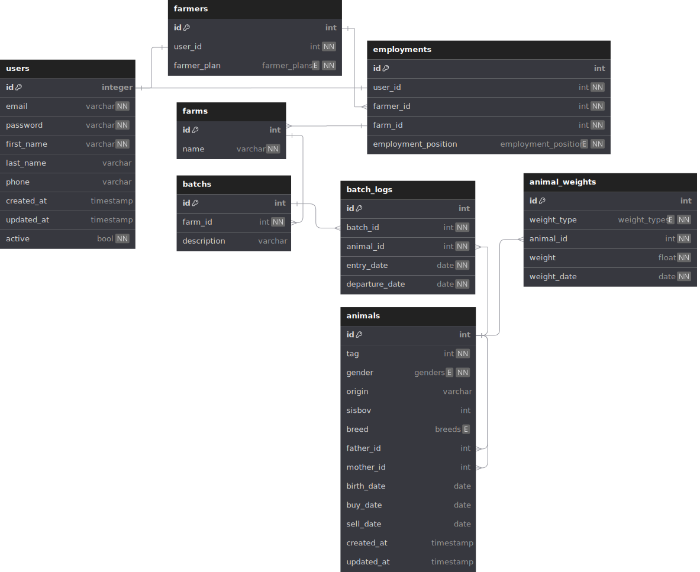

# API - Projeto de Modernização do Manejo

[](https://github.com/henriquesebastiao/modernizacao-manejo-api/actions/workflows/test.yml)
[](https://coverage-badge.samuelcolvin.workers.dev/redirect/henriquesebastiao/modernizacao-manejo-api)
[](https://github.com/henriquesebastiao/modernizacao-manejo-api)

API para o backend do projeto de modernização do manejo desenvolvida com FastAPI.

Esta API, construída com FastAPI, é a parte central de um projeto voltado para o setor agropecuário. Nosso objetivo é viabilizar uma gestão eficiente de informações sobre o rebanho de bovinos e seu desempenho, auxiliando os produtores rurais a tomar decisões mais assertivas e estratégicas.

A API visa proporcionar uma solução abrangente para o controle eficiente de informações relacionadas ao gado. Através dela, oferecemos funcionalidades robustas para realizar operações de CRUD no banco de dados, abrangendo desde o registro inicial até as análises avançadas de desempenho.

### Deploy 🚀

Você pode acessar a API [aqui](https://manejo-api.henriquesebastiao.com/).

Você também pode visualizar o deploy do banco de dados usando Adminer neste [link](https://adminer.henriquesebastiao.com/?pgsql=projects_postgres&username=manejo&db=manejo&ns=public).

Use a senha `manejo123`.

> Este usuário é apenas para leitura, fique a vontade para bisbilhotar :)

### Tecnologias utilizadas

#### Como núcleo da aplicação

- **Python** e **FastAPI**, para o desenvolvimento de uma API asyncrona e robusta.
- **Postgres** como banco de dados.
- **SQLAlchemy**, para interação com o banco de dados via ORM.
- **Pydantic**, para validação de dados.

#### Ferramentas usadas na implantação

- **Docker**, para desenvolvimento em containers.
- **Uvicorn** como servidor ASGI de aplicação.
- **Nginx**, como servidor web.
- **OpenTelemetry**, **Prometheus** e **Grafana** para observabilidade e telemetria.

#### Ferramentas usadas no desenvolvimento

- **PyTest**, para testes de integração.
- **Ruff** como linter e formatador de código.
- **Locust**, para testes de carga.

## Principais Recursos

CRUD Completo: Gerencie suas informações sobre o gado com facilidade, desde a adição de novos registros até a atualização e exclusão de dados existentes.

Análises de Desempenho: Utilize recursos avançados para avaliar o desempenho do gado, possibilitando a tomada de decisões mais estratégicas no manejo.

### Executar localmente em modo desenvolvimento

Toda a aplicação pode ser executada via Docker, logo você precisa somente dele instalado! ✅

Clone o repositório e entre nele com o seguinte comando:

```bash
git clone https://github.com/henriquesebastiao/modernizacao-manejo-api && cd modernizacao-manejo-api
```

Crie um arquivo `.env` que conterá as variáveis de ambiente exigidas pela aplicação, você pode fazer isso apenas copiando o arquivo de exemplo:

```bash
cat .env.example > .env
```

Agora execute o docker compose e toda aplicação será construída e iniciada em modo de desenvolvimento 🚀

```bash
docker compose watch
```

Pronto! Você já pode abrir seu navegador e acessar as seguintes URLs:

- Documentação interativa automática com Swagger UI (do backend OpenAPI): [http://localhost:8000](http://localhost:8000)
- Adminer, para visualizar facilmente o banco de dados: [http://localhost:8080](http://localhost:8080)
- Redoc, uma versão mais legível da documentação: [http://localhost:8000/redoc](http://localhost:8000/redoc)

Para acessar o banco de dados local pelo Adminer, selecione o sistema PostgreSQL e use as seguintes credenciais:

- Servidor: `database`
- Usuário: `user`
- Senha: `password`
- Banco de dados: `db`

### Diagrama do Banco de Dados 💾

Um diagrama do banco de dados para facilitar o entendimento da estrutura e dos relacionamentos entre as tabelas. O diagrama serve como uma referência visual para desenvolvedores e colaboradores, destacando como os dados estão organizados e conectados, e auxiliando na manutenção e na extensão do sistema.

[](https://raw.githubusercontent.com/henriquesebastiao/modernizacao-manejo-api/refs/heads/master/assets/db.svg)

### Observabilidade com OpenTelemetry 🔍

O projeto conta com ferramentas para observação de métricas da aplicação, sendo elas:

- **Prometheus**, para coleta de métricas.
- **Loki**, para coleta de logs.
- **Tempo**, para coletas de traces.

Por fim, todos os dados são enviados para o **Grafana**, onde podemos ver os dados em um dashboard.

Acesse o Grafana em: [https://localhost:3000](https://localhost:3000)

As credencias padrão são:

- Usuário: `admin`
- Senha: `admin`

Para visualizar o dashboard, clique em `Dashboards` no menu lateral direto e selecione `Manejo API`.

#### Testes de carga com Locust

Você pode executar testes de carga na aplicação para simular acessos aos endpoints, como possivelmente seria em um ambiente de produção.

Execute os testes com o seguinte comando:

```bash
task locust
```

Após isso você verá as métricas de acessos a API subindo constantemente no dashboard do Grafana. Para parar o testes pressione `ctrl` + `c`.


## Desenvolvendo 🛠️

Durante o desenvolvimento, você pode alterar as configurações do Docker Compose que afetarão apenas o ambiente de desenvolvimento local no arquivo `docker-compose.override.yml`.

As alterações nesse arquivo afetam apenas o ambiente de desenvolvimento local, não o ambiente de produção. Assim, você pode adicionar alterações "temporárias" que auxiliam no fluxo de trabalho de desenvolvimento.

Há também uma substituição de comando que é executada `fastapi run --reload` em vez do padrão `fastapi run`. Ele inicia um único processo de servidor (em vez de vários, como seria para produção) e recarrega o processo sempre que o código muda.

### Deploy com Docker Compose

Com as variáveis de ambiente configuradas, você pode fazer deploy com Docker Compose:

```bash
docker compose -f docker-compose.yml up -d
```

> [!IMPORTANT]
> Para produção, você não gostaria de ter as substituições feitas em `docker-compose.override.yml`, é por isso que especificamos explicitamente `docker-compose.yml` como o arquivo a ser usado.
